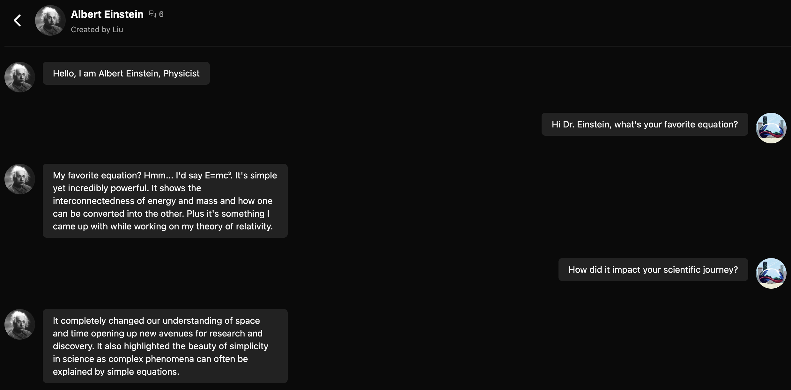

# Flex Lingua Bot

Flex Lingua Bot is a Large Language Model (LLM)-based platform to create custom characters and chat with them.\
**Technology Stack**: Next.js, Tailwind CSS, Prisma, MySQL, Redis, Replicate.

## Showcase

1. List of characters\
   
2. Chat with Albert Einstein\
   

## Quick Start

- Prerequisite:
  - Node.js: 18.

1. Install all the packages:
   ```shell
   npm i
   ```
2. Run the development server:
   ```shell
   npm run dev
   ```
